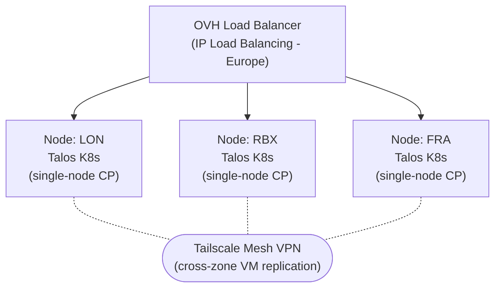
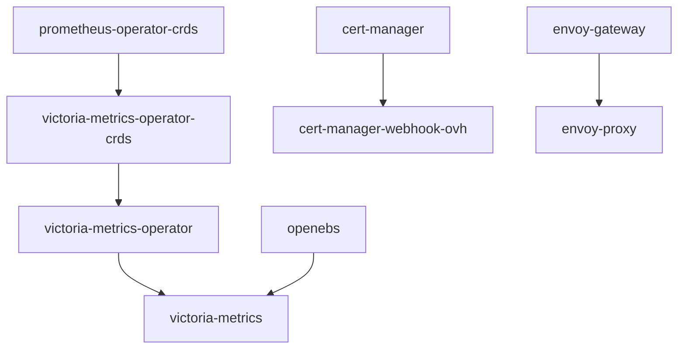
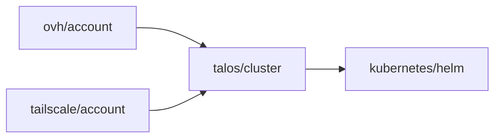
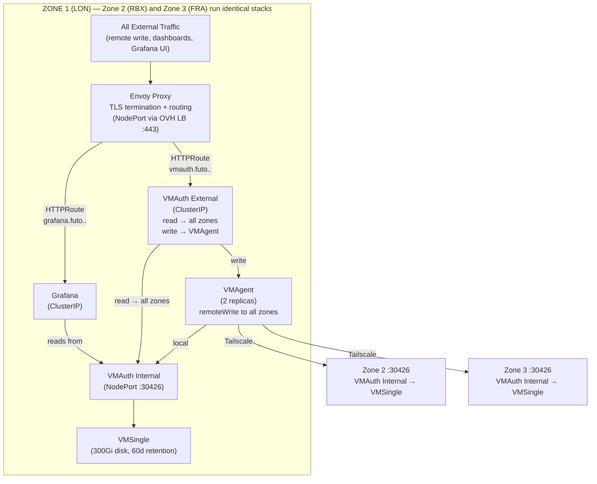
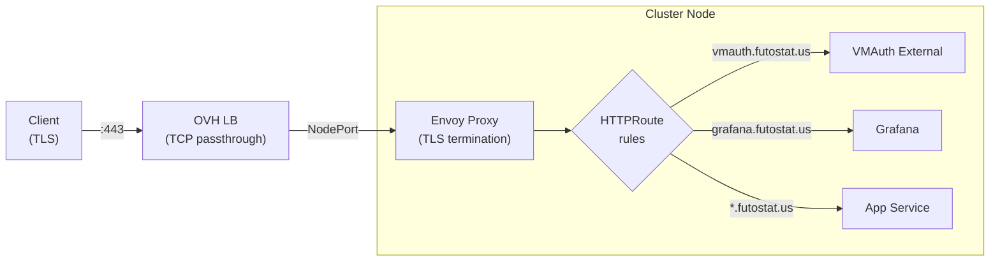
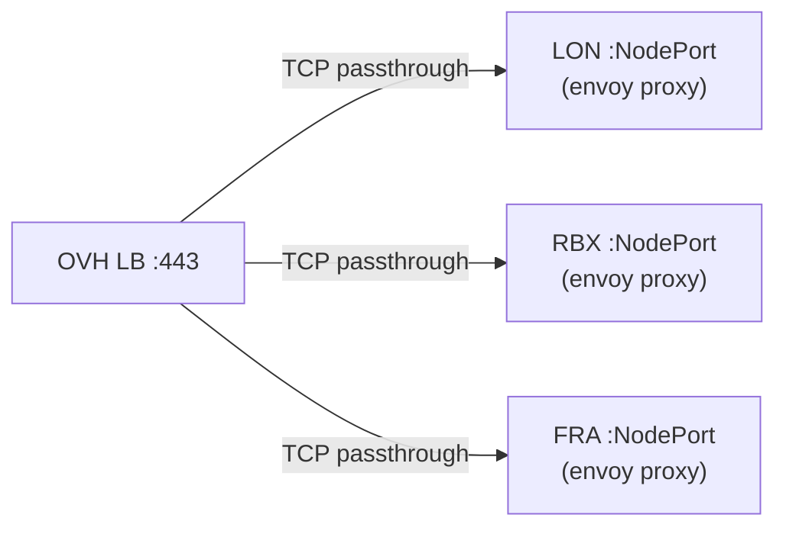

# Yucca O11y

Multi-environment observability platform running on bare-metal OVH servers with Talos Linux, managed by Flux CD.

## Table of Contents

- [Yucca O11y](#yucca-o11y)
  - [Table of Contents](#table-of-contents)
  - [Architecture Overview](#architecture-overview)
  - [Multi-Environment Cluster Architecture](#multi-environment-cluster-architecture)
    - [Environments](#environments)
    - [Per-Node Stack](#per-node-stack)
    - [Node Specifications (Staging)](#node-specifications-staging)
  - [Flux CD GitOps Structure](#flux-cd-gitops-structure)
    - [How It Works](#how-it-works)
    - [Example Dependency Chain](#example-dependency-chain)
    - [Renovate Integration](#renovate-integration)
  - [Infrastructure Provisioning](#infrastructure-provisioning)
    - [Dependency Flow](#dependency-flow)
  - [Victoria Metrics Architecture](#victoria-metrics-architecture)
    - [Components](#components)
    - [Data Flow](#data-flow)
    - [Authentication](#authentication)
  - [Ingress: Envoy Gateway with TLS](#ingress-envoy-gateway-with-tls)
    - [Traffic Flow](#traffic-flow)
  - [DNS Management](#dns-management)
    - [Wildcard DNS Records](#wildcard-dns-records)
  - [Cert-Manager with OVH DNS-01](#cert-manager-with-ovh-dns-01)
  - [OVH Load Balancer](#ovh-load-balancer)
    - [Configuration](#configuration)
    - [Load Balancer → Node Mapping](#load-balancer--node-mapping)
    - [DNS Resolution](#dns-resolution)
  - [Repository Layout](#repository-layout)

---

## Architecture Overview



Each environment (staging, production) runs **three independent single-node Talos Linux clusters** on OVH bare-metal servers in different European datacenters (London, Roubaix, Frankfurt). Each node is a full controlplane + worker. The clusters are connected via **Tailscale mesh VPN** for cross-zone Victoria Metrics replication.

---

## Multi-Environment Cluster Architecture

### Environments

| Environment | Nodes | Datacenters | Description |
| --- | --- | --- | --- |
| **Staging** | 3 | LON, RBX, FRA | Full replica of production for testing |
| **Production** | 3 | LON, RBX, FRA | Production observability platform |

### Per-Node Stack

Each node runs an identical Kubernetes stack deployed via Flux:

| Component | Purpose |
| --- | --- |
| **Flux Operator + Instance** | GitOps reconciliation from this repo |
| **Envoy Gateway** | Ingress controller (Gateway API) |
| **Envoy Proxy** | Data plane, TLS termination inside the cluster |
| **Victoria Metrics** | Metrics storage (VMSingle), collection (VMAgent), auth (VMAuth) |
| **cert-manager** | Automated TLS wildcard certificate management via OVH DNS-01 |
| **cert-manager-webhook-ovh** | OVH DNS-01 solver for cert-manager |
| **OpenEBS** | Local hostpath persistent volumes |
| **Prometheus Operator CRDs** | ServiceMonitor/PodMonitor CRDs for VM operator compatibility |

### Node Specifications (Staging)

| Node | Datacenter | Plan | Storage | RAM | VLAN IP |
| --- | --- | --- | --- | --- | --- |
| LON | London | 24sys012 | 2x512GB NVMe (RAID) | 32GB ECC | 10.150.200.10 |
| RBX | Roubaix | 24sys012 | 2x512GB NVMe (RAID) | 32GB ECC | 10.150.200.11 |
| FRA | Frankfurt | 24sys012 | 2x512GB NVMe (RAID) | 32GB ECC | 10.150.200.12 |

Nodes are connected via OVH vRack (private VLAN 2600) where available, and Tailscale for cross-datacenter communication.

---

## Flux CD GitOps Structure

The repository uses a **base + overlay** pattern with Flux Kustomizations:

```text
kubernetes/
├── apps/
│   ├── base/                    # Shared manifests (HelmReleases, CRDs, configs)
│   │   ├── cert-manager/
│   │   ├── cert-manager-webhook/
│   │   ├── envoy-gateway/
│   │   ├── envoy-proxy/
│   │   ├── openebs/
│   │   ├── prometheus-operator-crds/
│   │   ├── victoria-metrics/
│   │   ├── victoria-metrics-operator/
│   │   └── victoria-metrics-operator-crds/
│   ├── staging/                 # Staging-specific overlays
│   │   ├── cert-manager/
│   │   ├── envoy-system/
│   │   ├── o11y/
│   │   └── openebs-system/
│   └── production/              # Production-specific overlays (mirrors staging)
└── clusters/
    ├── staging/
    │   └── apps.yaml            # Cluster entrypoint for Flux
    └── production/
        └── apps.yaml
```

### How It Works

1. **Cluster bootstrap**: Terragrunt deploys the Flux Operator and Flux Instance via Helm into each node's cluster. The Flux Instance syncs from `kubernetes/clusters/<env>/`.

2. **Entrypoint** (`clusters/<env>/apps.yaml`): A top-level Flux Kustomization that points at `kubernetes/apps/<env>/` and applies global patches (CRD install strategy, upgrade remediation).

3. **Environment overlays** (`apps/<env>/`): Each subdirectory contains Flux Kustomizations that reference `base/` manifests and apply environment-specific patches (version pins for Renovate, dependency ordering).

4. **Base manifests** (`apps/base/`): Contains the actual HelmReleases, OCI repositories, and raw Kubernetes resources. These are reusable across environments.

5. **Variable substitution**: Environment-specific values (like cross-zone node IPs) are injected via `postBuild.substituteFrom` referencing ConfigMaps created by Terraform (e.g., `vm-zone-endpoints`).

### Example Dependency Chain



### Renovate Integration

OCI repository tags in staging overlays are annotated with Renovate comments for automated version bumps:

```yaml
# renovate: datasource=docker depName=ghcr.io/victoriametrics/helm-charts/victoria-metrics-operator
tag: 0.58.1
```

---

## Infrastructure Provisioning

Infrastructure is managed with **Terraform + Terragrunt** in four layers:

```text
deployment/modules/
├── ovh/account/          # 1. OVH servers, vRack, DNS records
├── tailscale/account/    # 2. Tailscale ACLs and tailnet settings
├── talos/cluster/        # 3. Talos Linux cluster bootstrap per node
└── kubernetes/helm/      # 4. Flux operator + secrets into each cluster
```

### Dependency Flow



1. **ovh/account**: Provisions bare-metal servers with Talos qcow2 images, creates vRack networking, and manages wildcard DNS records in OVH (e.g., `*.futostat.us`, `*.staging.futostat.us`, `*.futostatus.com`, `*.staging.futostatus.com`).

2. **tailscale/account**: Configures Tailscale ACLs, device approval policies, and tailnet settings.

3. **talos/cluster**: Bootstraps each node as a single-node Talos cluster with Tailscale extension. Creates auth keys, waits for Tailscale device registration, and generates kubeconfigs.

4. **kubernetes/helm**: Deploys Flux Operator + Instance into each cluster using the kubeconfig from the Talos module. Creates secrets (VMAuth credentials) and ConfigMaps (cross-zone node IPs) needed by the workloads.

---

## Victoria Metrics Architecture

Each zone runs a full Victoria Metrics stack. Data is replicated across all three zones for durability, and reads can fan out across zones for availability.



### Components

| Component | Role | Service Type | Port |
| --- | --- | --- | --- |
| **VMSingle** | Time-series storage | ClusterIP | 8428 |
| **VMAgent** | Scrapes & replicates metrics (2 replicas, 50Gi buffer) | ClusterIP | 8429 |
| **VMAuth Internal** | Routes cross-zone read/write to local VMSingle | NodePort | 30426 |
| **VMAuth External** | Routes external reads across all zones, writes to VMAgent | ClusterIP | 8427 |

### Data Flow

1. **Ingestion (write path)**:
   - External writers → OVH LB :443 → Envoy (TLS termination) → HTTPRoute → VMAuth External → VMAgent
   - VMAgent writes to:
     - Local zone via VMAuth Internal (ClusterIP → VMSingle)
     - Zone 2 via Tailscale IP (:30426 → VMAuth Internal → VMSingle)
     - Zone 3 via Tailscale IP (:30426 → VMAuth Internal → VMSingle)

2. **Query (read path)**:
   - **Grafana (in-cluster)**: Grafana → VMAuth Internal (ClusterIP) — no external hop, reads from the local zone's VMSingle directly
   - **External API consumers**: → OVH LB :443 → Envoy → HTTPRoute → VMAuth External → fans out reads to all zones via Tailscale IPs
   - VMAuth External uses `first_available` load balancing with retry on 429/5xx

3. **Cross-zone communication**: All inter-zone traffic flows over Tailscale mesh VPN using private IPs. VMAgent's `remoteWrite` targets and VMAuth External's read fanout use Tailscale IPs injected via the `vm-zone-endpoints` ConfigMap.

### Authentication

Credentials are generated by Terraform (`random_password`) and injected as Kubernetes Secrets:

- `vmauth-external-credentials`: reader/writer passwords for external VMAuth
- `vmauth-internal-credentials`: reader/writer passwords for internal VMAuth

---

## Ingress: Envoy Gateway with TLS

Envoy Gateway is the **single external ingress point** for all traffic using the **Gateway API**. TLS termination happens **inside the cluster** at Envoy — the OVH load balancer does TCP passthrough only.

All services (Grafana, VMAuth, dashboards, etc.) are exposed as ClusterIP services with HTTPRoutes directing traffic through Envoy. This means:

- One ingress point to secure, monitor, and rate-limit
- TLS managed entirely in-cluster by cert-manager
- No need to open additional NodePorts for individual services
- End-to-end encryption from client to Envoy

### Traffic Flow



---

## DNS Management

All DNS records are managed by **Terraform** in the `ovh/account` module using wildcard records. No in-cluster DNS controller (e.g., external-dns) is used.

### Wildcard DNS Records

Terraform creates A records and wildcard CNAME records pointing to the OVH Load Balancer for each environment:

```text
Terraform:  futostat.us              →  A      →  OVH LB IP
Terraform:  futostatus.com           →  A      →  OVH LB IP
Terraform:  *.futostat.us            →  CNAME  →  futostat.us      (production)
Terraform:  *.futostatus.com         →  CNAME  →  futostatus.com   (production)
Terraform:  *.staging.futostat.us    →  CNAME  →  futostat.us      (staging)
Terraform:  *.staging.futostatus.com →  CNAME  →  futostatus.com   (staging)
```

This means any subdomain (e.g., `vmauth.futostat.us`, `grafana.staging.futostat.us`) automatically resolves to the load balancer without per-service DNS records. Envoy handles routing to the correct backend based on the `Host` header via HTTPRoute rules.

---

## Cert-Manager with OVH DNS-01

TLS certificates are issued automatically via **cert-manager** using **DNS-01 challenges** solved against OVH DNS.

cert-manager with the [cert-manager-webhook-ovh](https://github.com/aureq/cert-manager-webhook-ovh) solver handles ACME DNS-01 challenges via the OVH API. Wildcard certificates are issued for each environment:

| Environment | Certificate | Domains |
| --- | --- | --- |
| **Production** | `*.futostat.us` | `vmauth.futostat.us`, `grafana.futostat.us`, etc. |
| **Production** | `*.futostatus.com` | `vmauth.futostatus.com`, `grafana.futostatus.com`, etc. |
| **Staging** | `*.staging.futostat.us` | `vmauth.staging.futostat.us`, `grafana.staging.futostat.us`, etc. |
| **Staging** | `*.staging.futostatus.com` | `vmauth.staging.futostatus.com`, `grafana.staging.futostatus.com`, etc. |

DNS-01 is used over HTTP-01 because it supports wildcard certificates, works regardless of load balancer configuration, and doesn't require exposing HTTP endpoints.

---

## OVH Load Balancer

An **OVH IP Load Balancing** instance provides a single stable public IP for each environment, distributing traffic across the three nodes.

### Configuration

| Setting | Value |
| --- | --- |
| **Region** | Europe |
| **Mode** | TCP passthrough (for TLS passthrough to Envoy) |
| **Backend nodes** | 3 (LON, RBX, FRA) |
| **Balance** | Round-robin |
| **Health check** | HTTP probe on backend ports |

### Load Balancer → Node Mapping

All external traffic enters through a single HTTPS frontend:



Envoy then routes to the appropriate ClusterIP service based on HTTPRoute rules (e.g., `vmauth.staging.futostat.us` → VMAuth External, `grafana.staging.futostat.us` → Grafana).

### DNS Resolution

All DNS is managed by Terraform using wildcard records:

| Record | Type | Target | Purpose |
| --- | --- | --- | --- |
| `futostat.us` | A | OVH LB IP | Base record |
| `futostatus.com` | A | OVH LB IP | Base record |
| `*.futostat.us` | CNAME | `futostat.us` | Production services |
| `*.futostatus.com` | CNAME | `futostatus.com` | Production services |
| `*.staging.futostat.us` | CNAME | `futostat.us` | Staging services |
| `*.staging.futostatus.com` | CNAME | `futostatus.com` | Staging services |

No per-service DNS records are needed — wildcard records cover all subdomains and Envoy routes traffic based on the `Host` header.

---

## Repository Layout

```text
.
├── deployment/                          # Infrastructure as Code
│   └── modules/
│       ├── ovh/account/                 # OVH servers, vRack, DNS, load balancer
│       ├── tailscale/account/           # Tailscale ACLs and settings
│       ├── talos/cluster/               # Talos Linux cluster per node
│       │   └── modules/node/            # Per-node: Talos config, bootstrap, Tailscale
│       └── kubernetes/helm/             # Flux operator, secrets, ConfigMaps
│           └── modules/cluster/         # Per-cluster Helm releases and resources
├── kubernetes/                          # Kubernetes manifests (GitOps source)
│   ├── apps/
│   │   ├── base/                        # Shared component definitions
│   │   ├── staging/                     # Staging overlay + patches
│   │   └── production/                  # Production overlay + patches
│   └── clusters/
│       ├── staging/apps.yaml            # Flux entrypoint for staging
│       └── production/apps.yaml         # Flux entrypoint for production
├── renovate.json                        # Automated dependency updates
└── README.md
```
