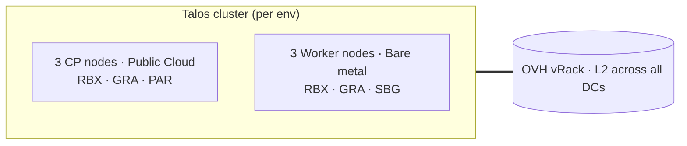

# Yucca O11y

Stretched-cluster observability platform: one Talos Kubernetes cluster per environment, spanning four OVH datacentres, managed by Flux.

## Architecture



Three CPs in low-RTT DCs form one etcd quorum. Three bare-metal workers carry the observability workload. Everything talks over a shared OVH vRack at L2. Each environment is its own independent cluster; no inter-env replication.

See [`docs/adr-yucca-o11y-topology.md`](./docs/adr-yucca-o11y-topology.md) for the rationale behind this shape.

## Staging topology

| Role | Plan | Spec | DCs |
| --- | --- | --- | --- |
| CP | `b3-8` (Public Cloud) | 2 vCPU, 8 GB RAM, 50 GB NVMe, 4 Gbps private | RBX, GRA, PAR |
| Worker | `SYS-2` (`24sys022`, bare-metal) | Xeon-D 2141I 8c/16t, 32 GB ECC DDR4, 2× 512 GB NVMe, 1 Gbps public + private | RBX, GRA, SBG |

Private CIDR `10.150.200.0/24`, CP VIP `10.150.200.5`. Operator-facing apiserver endpoint (in cert SANs): each CP's private IP. Production has the same shape with `Rise-1` workers and CIDR `10.150.100.0/24`.

## Worker storage

Talos under BYOI installs to `nvme0n1` only. The disk is carved into:

| Volume | Size (staging) | Mount | StorageClass | Purpose |
| --- | --- | --- | --- | --- |
| `EPHEMERAL` | 256 GB fixed | `/var` | — | containerd image cache, kubelet working dirs, logs |
| `hostpath` UserVolume | ~256 GB grow=true | `/var/mnt/hostpath` | `openebs-system-disk` (default) | general PVs — Grafana state, configs |
| `local-hostpath` UserVolume | ~512 GB (whole spare disk) | `/var/mnt/local-hostpath` | `openebs-spare-disk` | isolated workloads — vmstorage tsdb |

EPHEMERAL is wiped by Talos factory-reset; UserVolumes survive. The `openebs-spare-disk` class lives on `nvme1n1`, selected by a `disk.model == "WDC CL SN720…" && !system_disk` CEL match so it never accidentally grabs the install disk.

Rise-1 in production has 3× 1.92 TB NVMes — the install disk gets ~1.66 TB of hostpath, the two spares can be combined via Talos-managed mirror/stripe or exposed as a second StorageClass.

## Networking

- **vRack** is OVH's L2 network across all four DCs. Public Cloud private networks and bare-metal vRack interfaces share one untagged VLAN; CPs and workers see each other as a single L2 segment.
- **Talos VIP** at `cluster.controlPlane.endpoint` floats between CPs via etcd election. Kubelets and in-cluster components use it. Operators don't — cross-DC ARP for floating IPs is unreliable when routed over Tailscale.
- **Tailscale extension** runs on every node. CPs advertise the private CIDR as a subnet route, auto-approved via the tailnet ACL. Workers consume the routes.
- **Talos ingress firewall** drops public-NIC inbound to apid (50000), trustd (50001), kube-apiserver (6443), etcd (2379–2380), and kubelet (10250). Allowed sources: Tailscale CGNAT (`100.64.0.0/10`) and the vRack CIDR.
- **MetalLB L2** advertises one OVH Additional IP (the single usable host from a routed `/30` — OVH's edge router holds the other) for Envoy ingress. ARP-announced on the vRack from whichever speaker is elected leader.

## Ingress + TLS

Envoy Gateway is the only external ingress. Its LoadBalancer Service claims the MetalLB-advertised IP; TLS terminates at Envoy.

> **External ingress is currently blocked** by a MetalLB + OVH Additional-IP return-path asymmetry (replies egress the public NIC sourced from the Additional IP and OVH drops them). In-cluster everything works — certs issue, the Gateway programs, MetalLB assigns the IP, and the LB is reachable over the vRack. See the [topology ADR](./docs/adr-yucca-o11y-topology.md#ingress-return-path-asymmetry-metallb--ovh-additional-ip) for the proven root cause and the two fixes under consideration (connmark routing vs OVH managed LB).

`cert-manager` with `cert-manager-webhook-ovh` issues wildcard certificates via OVH DNS-01 challenges.

| Env | Wildcards |
| --- | --- |
| Staging | `*.staging.futostat.us`, `*.staging.futostatus.com` |
| Production | `*.futostat.us`, `*.futostatus.com` |

DNS A/CNAME records pointing at each env's Additional IP are managed by Terraform (`ovh/account/dns.tf`).

## Bootstrap

**One-time prep** per environment:

1. Create the env's 1Password vault (`o11y_tf_staging` or `o11y_tf_prod`).
2. Set up `.private/openstack/<env>/openrc.sh` for the env's OVH Public Cloud project.
3. Upload the Talos **OpenStack** image (control planes only) to the env's regions: `mise run talos:dl:cp && mise run talos:ul:cp`. This image carries the `qemu-guest-agent` + `tailscale` schematic.
4. Workers need **no download or upload** — they're OVH BYOI and pull the bare-metal raw straight from the Talos Factory at order time (`ovh/account/workers.tf` sets `image_url` to the Factory URL). The worker schematic (`talos_worker_schematic_id`) MUST stay **Tailscale-only**: `qemu-guest-agent` on bare metal blocks on a virtio port that never appears, wedging the Talos boot sequence and reboot-looping the node.
5. For production: delete v1 apex DNS records via the OVH dashboard before applying.

**Apply order** (set `ENVIRONMENT=staging` or `production` in the shell first):

```bash
export ENVIRONMENT=staging
export TF_VAR_env=staging

# 1. OVH: cloud project, vRack, private network, CP instances, workers, Additional IP, DNS.
#    First-time runs are slow — CP instances ~5 min each, bare-metal orders 20–45 min each.
mise run tg run --working-dir deployment/modules/ovh/account apply

# 2. Tailscale: tailnet-global ACL (only needs one run across all envs).
mise run tg run --working-dir deployment/modules/tailscale/account apply

# 3. Talos cluster — initial bring-up via public IPs (Tailscale extension isn't running yet).
TF_VAR_use_public_endpoints=true mise run tg run --working-dir deployment/modules/talos/cluster apply

# 4. Verify the cluster is up and operator-side Tailscale routing works.
mkdir -p .private/$ENVIRONMENT
mise run tg run --working-dir deployment/modules/talos/cluster output -- -raw talos_client_configuration > .private/$ENVIRONMENT/talosconfig
mise run tg run --working-dir deployment/modules/talos/cluster output -- -raw kubeconfig > .private/$ENVIRONMENT/kubeconfig
chmod 600 .private/$ENVIRONMENT/{talosconfig,kubeconfig}
# Pick any CP private IP — they're all valid cert SANs.
CP_IP=10.150.200.10
talosctl --talosconfig .private/$ENVIRONMENT/talosconfig --endpoints $CP_IP --nodes $CP_IP get members
sd -F "server: https://10.150.200.5:6443" "server: https://$CP_IP:6443" .private/$ENVIRONMENT/kubeconfig
kubectl --kubeconfig .private/$ENVIRONMENT/kubeconfig get nodes -o wide

# 5. Switch Talos terraform off public IPs (now that Tailscale routes work) and enable the
#    ingress firewall. Same module, same code, just drop the override.
unset TF_VAR_use_public_endpoints
mise run tg run --working-dir deployment/modules/talos/cluster apply

# 6. Flux + Helm: install Flux Operator/Instance, create bootstrap secrets and the metallb-pool
#    ConfigMap. After this, Flux owns cluster state from kubernetes/.
mise run tg run --working-dir deployment/modules/kubernetes/helm apply
```

Flux then reconciles from `kubernetes/clusters/<env>/apps.yaml`, fanning out to all the per-app Kustomizations in `kubernetes/apps/<env>/`.

## Operator access

Tailscale must be running on the operator's host with subnet-route consumption enabled (`tailscale set --accept-routes` on Linux; macOS GUI "Use Tailscale subnets" toggle). After that:

- **kubectl** — kubeconfig's default `server:` is the cluster VIP (works in-cluster, unreliable from outside). Rewrite to a CP private IP for operator use:

  ```bash
  sd -F 'https://10.150.200.5:6443' 'https://10.150.200.10:6443' .private/staging/kubeconfig
  ```

  The private IP is in the apiserver cert SANs (`controlplane.tf` adds all three), so TLS validates cleanly.

- **talosctl** — endpoints are already CP private IPs after step 5 of the bootstrap. The talosconfig also includes worker private IPs for direct node access.

## Repository layout

```text
deployment/modules/
├── ovh/account/          # cloud project, vRack, private network, CPs, workers, Additional IP, DNS
├── tailscale/account/    # tailnet-global ACL and tailnet settings
├── talos/cluster/        # machine secrets, CP + worker configs, bootstrap, ingress firewall
└── kubernetes/helm/      # Flux Operator + Instance, metallb-pool ConfigMap, env-scoped secrets

kubernetes/
├── apps/
│   ├── base/             # chart sources + reusable manifests (envoy, metallb, openebs, cert-manager, …)
│   └── staging/          # env overlay: Flux Kustomizations with version pins, dependsOn, substituteFrom
└── clusters/
    └── staging/apps.yaml # cluster-apps entry point, the Flux Instance points at this

docs/adr-yucca-o11y-topology.md  # topology ADR
```

State lives in S3 under `yucca/o11y/v3/<module>/<env>`. Secrets and OVH/Tailscale tokens come from the env's 1Password vault via `op run` and `deployment/.env`.

## Common operations

| Task | Command |
| --- | --- |
| Plan/apply one module | `mise run tg run --working-dir deployment/modules/<m> {plan,apply}` |
| Plan/apply all in dep order | `mise run tf:{plan,apply}` |
| Re-init backends | `mise run tf:init` |
| Format HCL / Terraform | `mise run tg:fmt` / `mise run tf:fmt` |
| Pull current kubeconfig | `mise run tg run --working-dir deployment/modules/talos/cluster output -- -raw kubeconfig > .private/$ENVIRONMENT/kubeconfig` |
